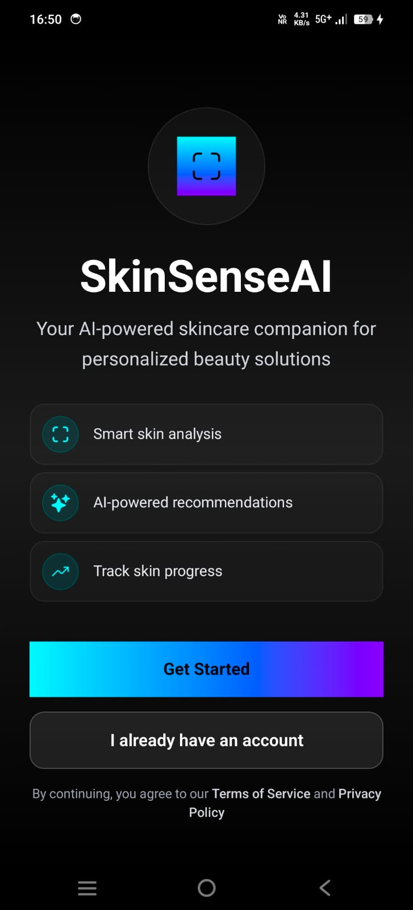
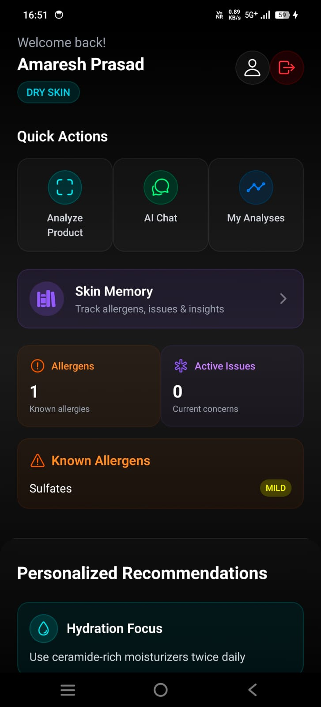
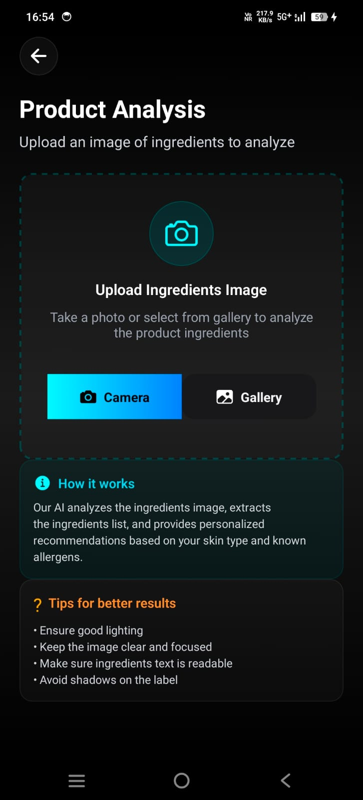
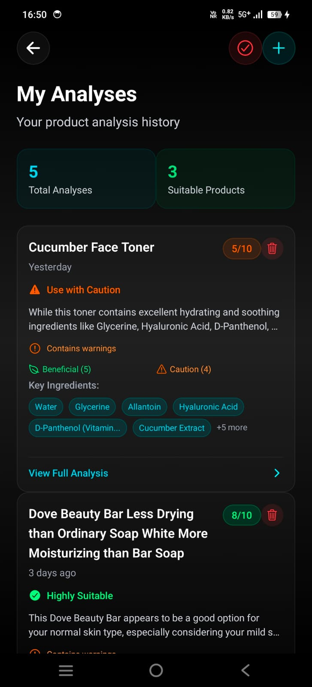
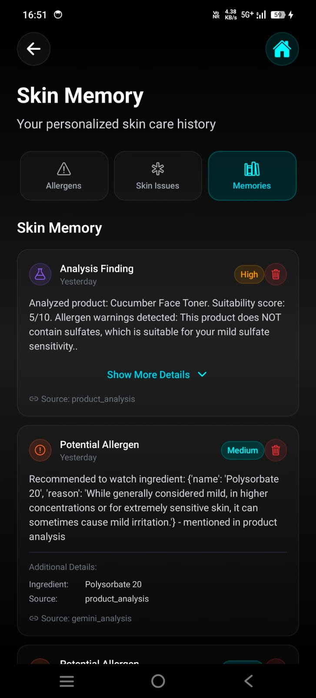
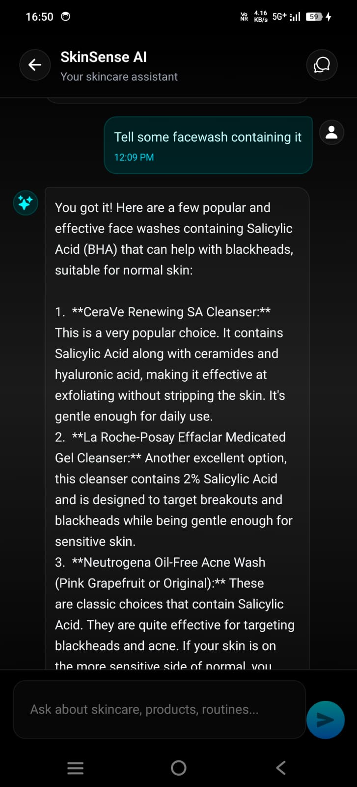
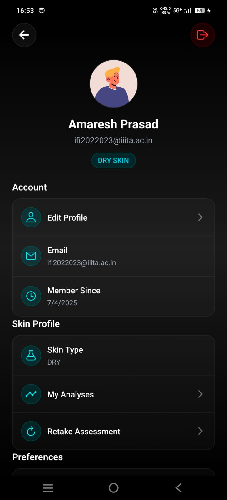

# SkinSenseAI 🌟

<div align="center">
  
  
  
  
</div>

<div align="center">
  <h3>🚀 Your AI-Powered Skincare Companion</h3>
  <p>Personalized beauty solutions powered by cutting-edge AI technology</p>
</div>

---

## 📱 Product Screenshots

<div align="center">
  
  
  
  
  
  
  
  
  
</div>

## ✨ Key Features

### 🔬 **Smart Product Analysis**
- **Ingredient Scanner**: Upload photos of product labels for instant AI analysis
- **Suitability Score**: Get personalized 1-10 compatibility ratings
- **Allergen Detection**: Identify potential skin irritants based on your profile
- **Ingredient Breakdown**: Detailed analysis of beneficial and concerning ingredients

### 🎯 **Personalized Skin Assessment**
- **Comprehensive Quiz**: Advanced skin type determination algorithm
- **Custom Recommendations**: Tailored advice based on your unique skin profile
- **Progress Tracking**: Monitor your skin journey over time
- **Concern Analysis**: Address specific skin issues with targeted solutions

### 🧠 **AI-Powered Chat Assistant**
- **24/7 Skincare Expert**: Get instant answers to your skincare questions
- **Contextual Advice**: Personalized recommendations based on your skin profile
- **Product Suggestions**: Smart recommendations for your specific needs
- **Memory Integration**: AI remembers your history for better advice

### 📊 **Skin Memory System**
- **Issue Tracking**: Monitor skin problems and their progress
- **Allergen Database**: Personal record of ingredients to avoid
- **Analysis History**: Complete log of all product analyses
- **Trend Analysis**: Identify patterns in your skin's responses

### 🔐 **Secure & Private**
- **End-to-End Encryption**: Your data is always protected
- **GDPR Compliant**: Full control over your personal information
- **Offline Mode**: Core features work without internet connection
- **Data Export**: Download your complete skincare history

## 🛠️ Technology Stack

### Frontend (React Native)
```javascript
// Core Technologies
React Native 0.72
Expo SDK 49
TypeScript
NativeWind (Tailwind CSS)

// State Management & Navigation
React Navigation 6
AsyncStorage
Context API

// UI/UX Libraries
Expo Linear Gradient
React Native Reanimated
Lottie React Native
```

### Backend (FastAPI)
```python
# API Framework
FastAPI 0.104
SQLAlchemy ORM
Alembic Migrations
Pydantic Validation

# AI & ML Integration
Google Gemini AI
OpenAI GPT Integration
Image Processing
Natural Language Processing

# Database & Storage
PostgreSQL
Redis Cache
Supabase Storage
```

### DevOps & Infrastructure
```yaml
# Deployment
Docker Containers
GitHub Actions CI/CD
Azure Cloud Services

# Monitoring & Analytics
Sentry Error Tracking
Analytics Dashboard
Performance Monitoring
```

## 🚀 Quick Start

### Prerequisites
- Node.js 18+
- Python 3.12+
- Expo CLI
- Android Studio / Xcode

### 1. Clone the Repository
```bash
git clone https://github.com/yourusername/skinsenseai.git
cd skinsenseai
```

### 2. Backend Setup
```bash
# Navigate to backend directory
cd fastapi-backend

# Create virtual environment
python -m venv myvenv
myvenv\Scripts\activate  # On Windows

# Install dependencies
pip install -r requirements.txt

# Set up environment variables
cp .env.example .env
# Edit .env with your API keys and database config

# Run database migrations
alembic upgrade head

# Start the server
uvicorn main:app --host 0.0.0.0 --port 8000 --reload
```

### 3. Frontend Setup
```bash
# Navigate to frontend directory
cd SkinSenseAI

# Install dependencies
npm install

# Set up environment variables
cp .env.example .env
# Edit .env with your backend URL and API keys

# Start the development server
npm start
```

### 4. Mobile App Testing
```bash
# For iOS (requires Xcode)
npx expo run:ios

# For Android (requires Android Studio)
npx expo run:android

# Or scan QR code with Expo Go app
```

## 📁 Project Structure

```
skinsenseai/
├── 📱 SkinSenseAI/                 # React Native Frontend
│   ├── 🎨 src/
│   │   ├── components/             # Reusable UI components
│   │   ├── screens/               # App screens
│   │   ├── services/              # API services
│   │   ├── contexts/              # React contexts
│   │   └── utils/                 # Utility functions
│   ├── 🎯 assets/                 # Images, fonts, etc.
│   └── 📋 package.json
├── 🖥️ fastapi-backend/            # FastAPI Backend
│   ├── 🔧 app/
│   │   ├── api/                   # API endpoints
│   │   ├── models/                # Database models
│   │   ├── services/              # Business logic
│   │   └── core/                  # Core configurations
│   ├── 🗄️ alembic/               # Database migrations
│   └── 📋 requirements.txt
└── 📚 docs/                       # Documentation
```

## 🎨 Design System

### Color Palette
```css
/* Primary Colors */
--primary-cyan: #00f5ff
--primary-blue: #0080ff
--primary-purple: #8000ff

/* Status Colors */
--success: #00ff88
--warning: #ffaa00
--error: #ff4444
--info: #00f5ff

/* Neutral Colors */
--background: #000000
--surface: #1a1a1a
--text-primary: #ffffff
--text-secondary: #888888
```

### Typography
- **Headers**: SF Pro Display / Roboto
- **Body**: SF Pro Text / Roboto
- **Code**: SF Mono / Roboto Mono

## 📊 API Documentation

### Core Endpoints

#### Authentication
```http
POST /api/v1/auth/register
POST /api/v1/auth/login
POST /api/v1/auth/refresh
DELETE /api/v1/auth/logout
```

#### Product Analysis
```http
POST /api/v1/products/analyze
GET /api/v1/products/history
GET /api/v1/products/{id}
```

#### Skin Profile
```http
POST /api/v1/skin/assessment
GET /api/v1/skin/profile
PUT /api/v1/skin/profile
```

#### AI Chat
```http
POST /api/v1/chat/sessions
GET /api/v1/chat/sessions
POST /api/v1/chat/{session_id}/messages
```

### Response Format
```json
{
  "success": true,
  "data": {
    "product_name": "Sample Product",
    "suitability_score": 8,
    "analysis_result": {
      "beneficial_ingredients": ["Niacinamide", "Hyaluronic Acid"],
      "concerning_ingredients": ["Fragrance"],
      "recommendation": "Suitable for your skin type"
    }
  },
  "message": "Analysis completed successfully"
}
```


## 🚀 Deployment

### Frontend Deployment (Expo)
```bash
# Build for production
eas build --platform all

# Submit to app stores
eas submit --platform all
```
### Backend Deployment (FastAPI)
-Its deployed on Azure App Service


## 📈 Performance Metrics

- **App Launch Time**: < 2 seconds
- **Image Analysis**: < 5 seconds
- **API Response Time**: < 500ms
- **Offline Capability**: 80% of features
- **Cross-Platform**: iOS & Android

## 🤝 Contributing

We welcome contributions! Please see our Contributing Guide for details.

### Development Workflow
1. Fork the repository
2. Create a feature branch (`git checkout -b feature/amazing-feature`)
3. Commit your changes (`git commit -m 'Add amazing feature'`)
4. Push to the branch (`git push origin feature/amazing-feature`)
5. Open a Pull Request
## 📄 License

This project is licensed under the MIT License - see the LICENSE file for details.

## 🙏 Acknowledgments

- **Google Gemini AI** for powerful image analysis
- **Expo Team** for excellent React Native tools
- **FastAPI** for the amazing Python framework
- **Open Source Community** for inspiration and support

## 📞 Support & Contact

<div align="center">
  
  **Need Help?**
  
  🐛 Bug Reports: [GitHub Issues](https://github.com/devAmaresh/SkinSenseAI/issues)
  
  📚 Documentation: [docs.skinsenseai.com](https://github.com/devAmaresh/SkinSenseAI)

</div>

---

<div align="center">
  <p>Made with ❤️ by the SkinSenseAI Team</p>
  <p>© 2025 SkinSenseAI. All rights reserved.</p>
</div>